  

<table>
<tr>
<td valign="top" width="50%">

</td>
<td valign="top" width="50%">
 
<h3 align="center">My Toolbox</h3>

  

 

</td>
</tr>
</table>

---

> *"Do nothing that is of no use."* — Miyamoto Musashi
